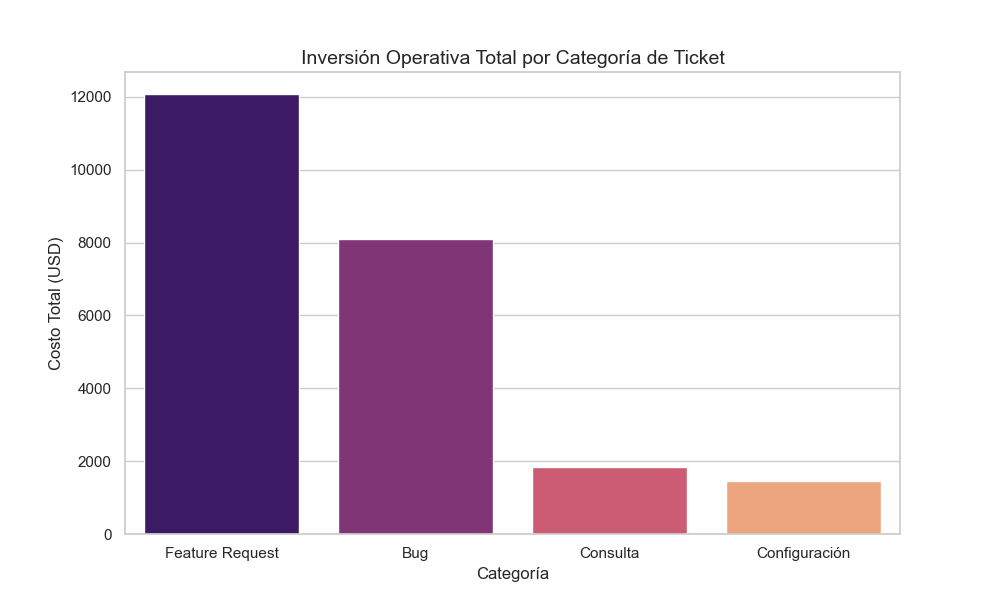
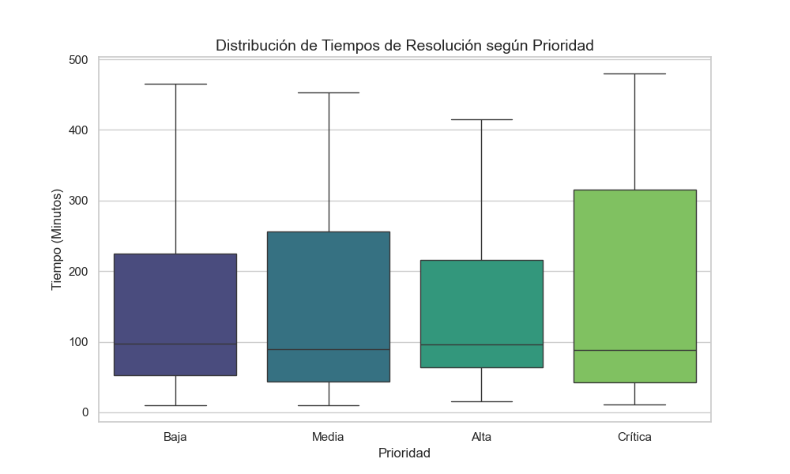

# Análisis de Eficiencia en Operaciones Tecnológicas 📊

Este proyecto realiza un **Análisis Exploratorio de Datos (EDA)** sobre un volumen de 200 registros de tickets de soporte técnico. El objetivo es identificar cuellos de botella operativos e impacto financiero por categoría.

---

## 📈 Visualizaciones del Análisis

### 1. Impacto Financiero por Categoría
Muestra qué tipos de tickets consumen la mayor parte del presupuesto operativo.

### 2. Distribución de Tiempos por Prioridad
Analiza el cumplimiento de tiempos de resolución según la urgencia del ticket.

---

## 💡 Hallazgos Clave
* **Bugs y Features:** Son las categorías con mayor costo acumulado debido a su complejidad técnica.
* **Variabilidad en Críticos:** Los tickets de prioridad 'Crítica' presentan una dispersión alta en tiempos, lo que indica oportunidades de mejora en la estandarización de procesos.

## 🛠 Herramientas Utilizadas
* **Python**: Procesamiento de datos con Pandas.
* **Matplotlib & Seaborn**: Generación de visualizaciones estadísticas profesionales.
